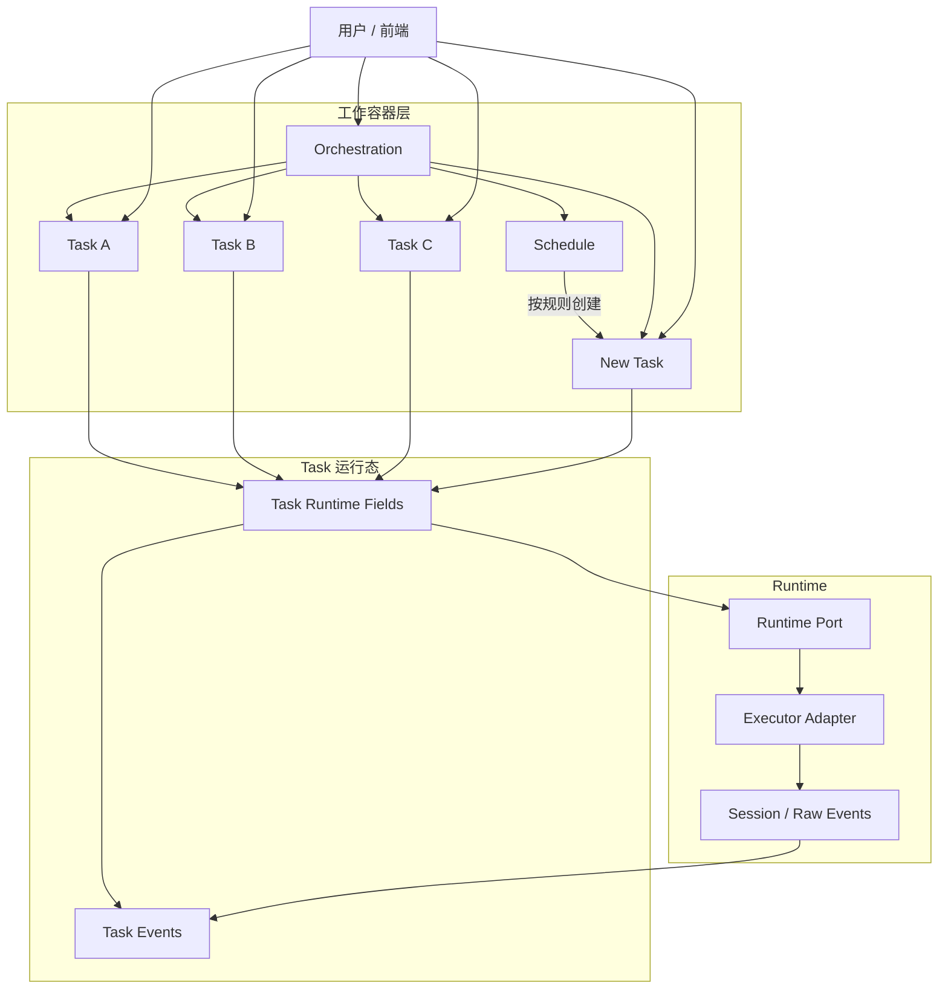

# 编排需求说明

## 1. 文档信息

- 文档名称：编排需求说明
- 日期：2026-04-01
- 状态：Proposed Canonical Product / System Direction
- 适用范围：
  - `apps/service/src/modules/orchestration`（future）
  - `apps/service/src/modules/task` 的重新定位
  - orchestration / task / schedule / runtime / interaction 的最终职责划分
- 关联文档：
  - [./backend-lite-ddd-design-2026-03-24.md](./backend-lite-ddd-design-2026-03-24.md)
  - [./task-context-design-2026-03-25.md](./task-context-design-2026-03-25.md)
  - [./task-runtime-system-design-2026-03-23.md](./task-runtime-system-design-2026-03-23.md)
  - [./service-database-schema-design-2026-03-25.md](./service-database-schema-design-2026-03-25.md)
  - [./task-api.md](./task-api.md)

## 2. 文档目标

本文定义 Harbor 在最终形态下的产品主对象与后端主线，并明确以下结论：

1. 用户的一级工作对象统一为 `orchestration`
2. `orchestration` 是工作容器，可以挂载多个 `task`
3. `task` 是用户可以直接交互的具体工作对象
4. `task` 直接承载用户字段与运行状态，不再引入独立的用户侧 `execution` 领域对象
5. `schedule` 通过固定的 `config + prompt` 重复创建新的 `task`
6. 编排的核心不是固定流水线，而是对多个 `task` 的组合与组织

本文不是迁移说明，也不是过渡兼容方案。

本文回答的是最终形态下的五个问题：

1. 用户看到的一级对象是什么
2. `orchestration / task / schedule / runtime` 的边界如何划分
3. 为什么 `task` 应继续保留为用户可交互对象
4. 为什么不把主模型设计成复杂树状工作流
5. schedule 应如何复用相同的配置与 prompt

## 3. 核心结论

### 3.1 `orchestration` 是唯一的用户主工作对象

Harbor 的用户可见一级工作对象不是单个 task，而是 `orchestration`。

用户理解中的以下行为：

1. 创建一个工作项
2. 在这个工作项下推进多个相关任务
3. 配置一个周期性重复执行的工作项

本质上都统一为：

```text
用户创建或操作一个 orchestration。
```

### 3.2 `orchestration` 的核心职责是组织多个 `task`

`orchestration` 不是一次性的运行结果，也不是复杂流程树本身。

它更像一个持续存在的工作容器，负责：

1. 挂载多个相关 task
2. 提供默认 prompt / config
3. 汇总 task 的状态与结果
4. 作为 schedule 的绑定目标

一句话收敛：

```text
Orchestration 是工作容器，Task 是容器中的可交互工作单元。
```

### 3.3 `task` 是用户可以直接交互的具体对象

`task` 表示某个 `orchestration` 下面的一项具体工作。

用户可以：

1. 选择某个 task 继续对话
2. 修改该 task 的 prompt 或配置
3. 查看该 task 的状态与输出
4. 基于已有 task 派生新的 task

在产品语义上，`task` 是当前系统里真正承载一次 agent 工作过程的对象。

### 3.4 `task` 直接承载运行状态

在最终模型中，不再单独引入一个与 `task` 一对一的 `execution` 领域对象来表达运行状态。

与运行相关的关键状态与技术字段，直接归属于 `task`，例如：

1. executor / model / executionMode / effort
2. sessionId
3. workingDirectory
4. command / exitCode / errorMessage
5. task events 与 task status

一句话收敛：

```text
Task 同时承载用户工作语义与运行态摘要，但用户交互仍只围绕 Task 展开。
```

### 3.5 所有 `task` 默认都是同级对象

在主模型中：

1. 一个 orchestration 下可以有多个 task
2. 这些 task 默认是同级关系
3. 不把 task 组织成复杂树状结构
4. 不把编排主模型设计成固定流水线求值引擎

如果需要表达 task 之间的来源关系，可以保留轻量引用关系，但不把它升级为复杂树模型。

### 3.6 `schedule` 的职责是重复创建 `task`

`schedule` 是独立的触发对象。

它的核心职责不是描述复杂流程，而是：

1. 绑定到某个 orchestration
2. 持有固定的 prompt
3. 持有固定的 config
4. 按时间规则重复创建新的 task

一句话收敛：

```text
Schedule 用同一份 config 与 prompt，反复创建新的 Task。
```

### 3.7 组合优于固定流水线

本系统的核心设计原则是：

1. 优先通过多个 task 的组合来完成复杂工作
2. 不预设复杂树状节点系统作为主模型
3. 不要求用户先设计完整 workflow 才能开始工作
4. 用户可以在运行中增加、调整、替换 task

也就是说：

```text
编排的重点是组织多个 Task，而不是维护一棵固定流程树。
```

## 4. 核心概念与对象层次

最终模型中的对象层次如下：

```text
Orchestration
  ├─ 挂载一个或多个 Task
  └─ 绑定零个或多个 Schedule

Task 直接承载用户字段、运行状态与事件关联。
Schedule 负责重复创建新的 Task。
Runtime 负责执行 Task 对应的内部运行。
```

### 4.1 `Orchestration`

用户主对象，长期存在，用来表达“这项工作本身”。

### 4.2 `Task`

`Orchestration` 之下的具体工作单元，是用户直接交互、推进和调整的主要对象。

### 4.3 `Schedule`

独立的触发策略对象，用来按固定规则创建新的 `Task`。

## 5. 产品模型

### 5.1 主列表展示 `orchestration`

前端默认列表展示用户可理解的工作项：

1. orchestration 列表
2. orchestration 的聚合状态
3. orchestration 下最近的 task 摘要
4. orchestration 绑定的 schedule 信息

### 5.2 详情页展示 `task` 列表

在 orchestration 详情页中，用户应能看到：

1. 当前 orchestration 下的 task 列表
2. 每个 task 的标题、状态、摘要与更新时间
3. 用户当前正在交互的 task
4. task 的来源信息（如有）

### 5.3 用户与 `task` 交互，而不是直接与 `orchestration` 对话

默认交互语义应为：

1. 用户进入某个 orchestration
2. 用户选择一个 task 进行对话
3. 后续消息默认进入当前选中的 task
4. 如需新的方向，可以在同一 orchestration 下创建新的 task

这意味着：

1. orchestration 是工作空间
2. task 是工作对话与推进单元

### 5.4 多 task 的组织方式是组合，不是树

一个 orchestration 可以同时包含多个 task，例如：

1. 一个用于架构设计
2. 一个用于文档编写
3. 一个用于代码实现
4. 一个用于代码审查

它们默认是同级对象。

系统可以允许保留轻量的来源或依赖信息，但不把这种关系升级成复杂树状编排主模型。

### 5.5 schedule 的产品语义

用户配置 schedule 时，本质上是在说：

1. 对这个 orchestration 绑定一个重复触发规则
2. 每次触发时使用指定的 prompt
3. 每次触发时使用指定的 config
4. 每次触发都创建一个新的 task

## 6. 最终职责分层

### 6.1 `orchestration` 负责什么

`orchestration` 是用户可见工作容器，负责：

1. orchestration identity
2. 工作项标题、描述与默认配置
3. task 的归档与组织
4. task 聚合状态与摘要
5. schedule 绑定关系
6. 用户主列表的读模型边界

`orchestration` 不直接负责：

1. 具体一次 task 的对话状态
2. runtime session 细节
3. executor 适配细节
4. 复杂树状流程求值

### 6.2 `task` 负责什么

`task` 是用户直接交互的具体对象，负责：

1. 承载某次 agent 工作过程
2. 持有该次工作的 prompt 与配置摘要
3. 记录对话、状态、摘要与输出
4. 作为用户继续追问、修正和推进的目标对象
5. 直接承载运行状态与事件关联

`task` 不负责：

1. 作为系统一级工作容器
2. 绑定多个 schedule
3. 管理其他 task 的聚合状态
4. 直接暴露 runtime raw protocol

### 6.3 `schedule` 负责什么

`schedule` 是独立领域对象，负责：

1. 触发规则定义
2. 时区语义
3. 启停状态
4. 固定 prompt
5. 固定 config
6. 为 orchestration 周期性创建新的 task

`schedule` 不负责：

1. 具体执行过程
2. 用户对 task 的持续交互
3. 复杂流程编排

### 6.4 `runtime` 负责什么

`runtime` 负责：

1. executor adapter
2. provider process / session lifecycle
3. raw runtime event 的事实来源
4. cancel / resume / sandbox / network 等执行策略

`runtime` 不负责：

1. orchestration 聚合语义
2. task 的用户产品语义
3. schedule 配置语义

### 6.5 `interaction` 负责什么

`interaction` 继续作为交付上下文，只消费外部可见读模型，负责：

1. orchestration 列表与详情展示
2. task 列表与详情展示
3. 用户与当前 task 的对话入口
4. 用户可见的 output / summary / progress

## 7. 领域模型

### 7.1 `Orchestration`

`Orchestration` 是用户主对象，建议最小语义包括：

1. `id`
2. `projectId`
3. `title`
4. `description`
5. `initPrompt`
6. `config`
7. `status`
   - `active`
   - `archived`
8. `createdAt`
9. `updatedAt`

说明：

1. `Orchestration` 是持续存在的工作容器，不等于某次具体工作
2. 一个 `Orchestration` 可以挂载多个 `Task`
3. orchestration 的聚合状态应来自其下 task 的汇总结果

### 7.2 `Task`

`Task` 是某个 `Orchestration` 下的具体工作单元，也是用户直接交互的对象。

建议最小语义包括：

1. `id`
2. `orchestrationId`
3. `projectId`
4. `title`
5. `prompt`
6. `status`
   - `queued`
   - `running`
   - `waiting`
   - `completed`
   - `failed`
   - `cancelled`
   - `archived`
7. `kind`
   - `primary`
   - `architecture`
   - `documentation`
   - `implementation`
   - `review`
   - `custom`
8. `sourceTaskId`（可选）
9. `summary`
10. `executorType`
11. `executorModel`
12. `executionMode`
13. `executorEffort`
14. `workingDirectory`
15. `sessionId`
16. `command`
17. `exitCode`
18. `errorMessage`
19. `createdAt`
20. `updatedAt`
21. `startedAt`
22. `finishedAt`

说明：

1. `Task` 是用户选择并继续对话的对象
2. 同一 orchestration 下的 task 默认是同级关系
3. `sourceTaskId` 仅用于记录轻量来源关系，不表示复杂树结构
4. 与执行相关的技术字段直接挂在 task 上，不再单独抽一个用户侧 execution 对象

### 7.3 `TaskEvent`

`TaskEvent` 是 task 的事件流对象，建议最小语义包括：

1. `id`
2. `taskId`
3. `sequence`
4. `eventType`
5. `payload`
6. `createdAt`

说明：

1. `TaskEvent` 服务于 task 的会话展示与状态投影
2. raw runtime event 可以作为底层事实来源，但前端主视图消费的是 task-facing event stream

### 7.4 `Schedule`

`Schedule` 是独立触发对象，建议最小语义包括：

1. `id`
2. `orchestrationId`
3. `status`
   - `active`
   - `archived`
4. `triggerRule`
5. `timezone`
6. `prompt`
7. `config`
8. `nextTriggerAt`
9. `lastTriggeredAt`
10. `createdAt`
11. `updatedAt`

说明：

1. `Schedule` 不是 `Task`
2. `Schedule` 每次触发都创建一个新的 `Task`
3. `Schedule` 使用自己绑定的 prompt 与 config，而不是临时从其他 task 抽取

### 7.5 编排读模型

用户界面消费的主契约应围绕 orchestration 与 task 的读模型，而不是直接暴露底层 runtime 记录。

建议 orchestration 列表读模型至少包括：

1. `id`
2. `title`
3. `status`
4. `scheduleCount`

当前不建议把 task 统计字段作为 orchestration 列表读模型的一部分。

原因：

1. 当前产品不需要在 orchestration 列表或详情里展示 task 数量摘要
2. 这些字段会引入额外的聚合接口与投影复杂度
3. 如果后续确实需要恢复，应先有明确的 UI/产品消费方，再决定聚合边界

建议 task 列表读模型至少包括：

1. `taskId`
2. `orchestrationId`
3. `title`
4. `kind`
5. `status`
6. `summary`
7. `sourceTaskId`
8. `updatedAt`

## 8. 关键不变量

### 8.1 用户永远不直接操作内部运行记录

最终形态下：

1. 用户创建或操作 `orchestration`
2. 用户在 orchestration 下创建或选择 `task`
3. runtime 与底层运行记录只服务于 task 的内部执行与状态投影

### 8.2 一个 `orchestration` 必须可以挂载多个 `task`

因为：

1. 用户可能在同一个工作项下探索多个方向
2. 同一个工作项下可能同时存在架构、文档、实现、审查等多个 task
3. schedule 会反复为同一个 orchestration 创建新的 task

### 8.3 `task` 是用户主要交互对象

默认规则应为：

1. 用户进入 orchestration 后，应选择一个 task 进行交互
2. 后续消息默认落到当前选中的 task
3. 如需切换工作方向，应切换或新建 task，而不是把所有对话混在 orchestration 上

### 8.4 `task` 默认是同级关系

系统允许存在 task 之间的轻量引用，但默认规则应为：

1. 不构建复杂树状主模型
2. 不要求固定流程节点结构
3. 不把多 task 的组织方式设计成重量级工作流引擎

### 8.5 `task` 是唯一权威状态来源

最终规则应为：

1. 用户可见状态以 task 为准
2. 不再单独引入一个与 task 并行的 execution 状态机
3. runtime 与底层记录通过投影更新 task 状态
4. 前端主视图不直接消费底层技术状态

### 8.6 `schedule` 只负责重复创建新的 `task`

最终规则应为：

1. schedule 持有固定 prompt
2. schedule 持有固定 config
3. 每次触发都创建新的 task
4. schedule 不直接复用某个正在进行中的 task 实例

### 8.7 前端主视图不直接消费 raw runtime event

最终规则应为：

1. raw event 由 runtime / 底层存储持有
2. 前端主视图消费 orchestration / task 读模型
3. 如需调试 raw event，应单独设计内部查询，而不是污染主契约

## 9. 功能需求

### FR-1 用户入口统一到 `orchestration`

1. 用户可以创建 orchestration
2. 用户在 orchestration 下组织多个 task
3. 用户不直接操作底层运行记录

### FR-2 用户必须能够直接与 `task` 交互

1. 用户可以选择某个 task 继续对话
2. 用户可以创建新的 task
3. 用户可以查看每个 task 的状态、摘要与输出

### FR-3 支持同一个 `orchestration` 下的多 task 组合

1. 一个 orchestration 可以同时存在多个 task
2. 多个 task 默认是同级对象
3. 系统可以记录轻量来源关系，但不引入复杂树状主模型

### FR-4 支持 schedule 重复创建 `task`

1. schedule 绑定 orchestration
2. schedule 使用固定的 prompt 与 config
3. 每次触发创建新的 task
4. schedule 可暂停、恢复与归档

### FR-5 orchestration 主列表展示聚合结果

1. 工作台主列表返回 orchestration list item
2. orchestration 详情页返回 task 列表
3. task 详情页返回会话与状态信息

### FR-6 task 继续作为用户工作对象保留

1. task 不被压回纯内部层
2. task 继续承载用户产品对象语义
3. runtime 与底层记录不直接作为前端主 contract 暴露

## 10. API 与读模型方向

### 10.1 主 API 应围绕 `orchestration` 与 `task`

推荐最终主接口形态：

1. `POST /v1/orchestrations`
2. `GET /v1/orchestrations`
3. `GET /v1/orchestrations/:orchestrationId`
4. `POST /v1/orchestrations/:orchestrationId/tasks`
5. `GET /v1/orchestrations/:orchestrationId/tasks`
6. `GET /v1/tasks/:taskId`
7. `GET /v1/tasks/:taskId/events`
8. `POST /v1/tasks/:taskId/resume`
9. `POST /v1/tasks/:taskId/cancel`
10. `PUT /v1/tasks/:taskId/title`
11. `POST /v1/tasks/:taskId/archive`
12. `DELETE /v1/tasks/:taskId`
13. `POST /v1/orchestrations/:orchestrationId/schedules`
14. `GET /v1/orchestrations/:orchestrationId/schedules`
15. `POST /v1/schedules/:scheduleId/pause`
16. `POST /v1/schedules/:scheduleId/resume`

### 10.2 底层运行接口降为内部或调试接口

最终原则：

1. 不再以底层运行记录作为前端主工作台契约
2. 如需保留底层运行状态查询，应归类到内部调试契约
3. 业务界面应围绕 orchestration / task / schedule

## 11. 当前 `task` 设计审查

### 11.1 当前 `task` 模块的主要结构

当前 `task` 模块主要由以下几层构成：

1. 领域对象：`Task`
2. 应用用例：create / resume / cancel / archive / delete / detail / events / list
3. 读模型：`TaskListItem` / `TaskDetail` / `TaskEventStream`
4. 运行时适配：`TaskRuntimePort`、`task-execution-driver`
5. 交互契约：task interaction queries / stream
6. 持久化：`Task` 表 + task 事件与底层运行记录

### 11.2 当前 `task` 实际承担的语义

从当前实现看，`task` 同时承担了两类语义。

第一类是产品语义：

1. task 是主列表对象
2. task 是详情页对象
3. task 是用户交互与追问的目标对象
4. task 是前端订阅与事件流的主题对象

第二类是运行语义：

1. task 持有 prompt
2. task 持有 executor / model / executionMode / effort 等运行配置摘要
3. task 支持 start / resume / cancel
4. task 对接 runtime raw events 与事件投影

这意味着当前的 `task` 已经非常接近本文定义里的最终 task，而不是一个需要被替换掉的过渡对象。

### 11.3 当前设计中值得保留的部分

当前实现并不是偏离目标，相反，它已经有几块非常适合保留：

1. `task` 作为用户可见、可交互对象的整体语义应该保留
2. `TaskDetail` / `TaskListItem` 这类读模型可以直接继续沿用
3. create / resume / cancel / get events 等用例天然符合 task 生命周期
4. interaction service 里围绕 task 的查询与订阅语义，本质上就是未来 task 查询与订阅语义

### 11.4 当前设计的核心问题

当前设计的主要问题不再是 task 与 execution 该如何双层并存，而是要避免继续把一对一运行记录提升成独立领域对象。

因此更合理的边界是：

1. 当前 `Task` 继续保留为用户工作对象
2. 与运行相关的核心状态与字段直接并入 task 语义
3. runtime 与底层记录只作为 task 的内部实现细节存在
4. 在其上新增 `Orchestration` 作为多个 task 的容器

### 11.5 结论

基于当前实现，更合理的判断是：

1. 当前 `task` 模块不应被压回纯内部层
2. 当前 `task` 模块应继续作为用户可交互对象保留
3. 不必再维持与 task 一对一的独立 execution 领域对象
4. 新增 `orchestration` 作为多个 task 的上层容器

一句话收敛：

```text
保留 Task 作为用户工作对象。
新增 Orchestration 作为多个 Task 的容器。
运行状态直接并入 Task，而不是再抽一层独立 Execution 领域对象。
```

## 12. 当前 `task` 模块如何接入 `orchestration`

### 12.1 总体原则

改造方向不是“把 task 改名成 execution”，也不是“再保留一层一对一 execution 领域对象”，而是：

1. 保留当前 `task` 模块的用户语义与交互模式
2. 在其上新增 `orchestration` 作为上层容器
3. 将运行相关的关键状态与字段直接收敛到 task 主模型或其附属投影上

也就是说：

```text
当前 Task -> 继续保留为用户侧 Task
新增 Orchestration -> 作为多个 Task 的工作容器
runtime / raw events -> 继续作为 Task 的内部执行实现细节
```

### 12.2 领域对象改造建议

建议按以下方式重构：

1. 保留当前 `Task` 领域对象名称
2. 为其新增 `orchestrationId`
3. 保留当前核心字段：`prompt`、`title`、`status`、时间戳
4. 让 executor / model / executionMode / effort / sessionId 等字段直接挂在 task 或 task 读模型上
5. `sourceTaskId` 可作为轻量来源关系补充字段

这样做的原因是：

1. 当前 task 已经承担了用户交互所需的大部分语义
2. 强行维持一层一对一 execution 领域对象收益不大，反而会增加双状态源复杂度
3. 直接把 orchestration 作为上层容器接入，改造成本最低、语义也最自然

### 12.3 仓储与读模型改造建议

建议演化方向如下：

1. 保留 `TaskRepository`
2. `listProjectTasks` 逐步演化为 `listOrchestrationTasks` 或补充 orchestration 维度查询
3. `TaskListItem` / `TaskDetail` 继续作为主读模型
4. orchestration 读模型保持轻量，不额外聚合 task 统计字段

补充约束：

1. 当前 orchestration 模块不暴露 task summary / task stats 投影
2. 如果以后要恢复 task 统计或 latest-task 类字段，必须先有明确消费场景，再决定是在 orchestration 侧聚合还是在查询层拼装

在读模型层，当前 task 已经包含：

1. 用户关心的标题与状态
2. 运行配置摘要
3. prompt
4. 事件流

这说明当前 task 读模型可以继续作为主交互基础，不需要因为引入 orchestration 而推倒重做。

### 12.4 路由与交互契约改造建议

建议按以下顺序调整对外契约：

1. 新增 `POST /orchestrations`
2. 新增 `POST /orchestrations/:orchestrationId/tasks`
3. 新增 `GET /orchestrations/:orchestrationId/tasks`
4. 保留 `GET /tasks/:taskId`
5. 保留 `POST /tasks/:taskId/messages`
6. 保留 `POST /tasks/:taskId/cancel`
7. 保留 `GET /tasks/:taskId/events`

interaction 侧也应新增 orchestration 维度，但 task 维度继续保留：

1. 新增 orchestration list query
2. 新增 orchestration detail query
3. 保留 task detail query
4. 保留 task stream event

### 12.5 持久化层改造建议

持久化层建议拆成两层：

第一层是用户侧主对象：

1. `Orchestration`
2. `Task`
3. `TaskEvent`

第二层是内部执行实现：

1. runtime session
2. raw event storage
3. 执行驱动过程中的技术快照

推荐关系为：

1. `Orchestration 1:N Task`
2. `Task 1:N TaskEvent`
3. runtime 与底层存储通过 `taskId` 关联

这一点应在模型与命名上明确固化，避免继续出现一对一 execution 领域对象与 task 并存的摇摆。

### 12.6 最小落地路径

按当前仓库情况，最小改造路径建议是：

1. 先新增 `orchestration` 模块，作为 task 的上层容器
2. 在数据层为当前 task 增加 `orchestrationId`
3. 新增 orchestration 列表与详情接口
4. 新增 orchestration 下 task 列表与创建接口
5. 保持当前 task 的主体读写逻辑不变
6. 将一对一 execution 领域语义收敛为 task 的运行字段与内部实现
7. schedule 直接创建新的 task

这样可以最大程度复用现有代码，同时让最终模型与产品语义对齐。

## 13. 非目标

本轮最终方案不定义：

1. 复杂树状编排引擎
2. DAG 依赖调度系统
3. 子编排树主模型
4. 固定流程节点求值机制
5. 多租户分布式调度架构
6. 任意厂商 runtime 的专有事件协议

## 14. 架构图



## 15. 一句话结论

Harbor 的最终形态应是：

```text
Orchestration 是用户主工作容器。
Task 是用户可以直接交互的具体工作对象。
一个 Orchestration 可以挂载多个同级 Task。
Task 直接承载运行状态与事件关联。
Schedule 使用固定的 config 与 prompt，重复创建新的 Task。
```

## 16. 新需求开发步骤

本节用于记录基于当前 canonical 文档推进新需求的推荐开发顺序，目标是在不引入额外漂移的前提下，把现有实现逐步收敛到：

```text
Orchestration -> N Tasks
Task 继续作为用户工作对象
Runtime 继续作为内部执行层
```

### 16.1 总体原则

这次开发不是在旧 task 系统上继续打补丁，而是围绕当前主模型逐步收口。

需要遵守三条红线：

1. 新功能不再以 `project -> tasks` 作为最终目标模型
2. 不新增新的 runtime-facing 或 execution-facing 产品接口
3. 不把复杂树状 workflow 引回主模型

一句话收敛：

```text
先做 Orchestration 容器化，再做 Task 归属化，最后再做运行态收口。
```

### 16.2 阶段 0：冻结目标模型

目标：先把目标模型固定下来，避免实现继续朝旧方向增长。

主要工作：

1. 将当前 `docs/orchestration-requirements-2026-03-31.md` 视为 canonical 需求文档
2. 将当前 `docs/tdd/orchestration.md` 视为 canonical TDD 文档
3. 团队内部明确以下结论：
   - `Orchestration` 是一级工作容器
   - `Task` 是用户直接交互对象
   - 不再引入新的独立 execution 领域对象
4. 旧 task-only 文档继续保留，但只作为历史背景参考

完成标准：

1. 团队对目标模型没有歧义
2. 新开发不再继续扩张旧的 project-task-only 心智

### 16.3 阶段 1：先补数据模型

目标：先把容器关系落到数据层，但不急着改交互。

主要工作：

1. 新增 `Orchestration` 表
2. 给当前 `Task` 表新增 `orchestrationId`
3. 暂时保留 `projectId`，避免一次性迁移过猛
4. 不在这一阶段引入 schedule 实现
5. 不在这一阶段重做 runtime 结构

推荐关系：

1. `Project 1:N Orchestration`
2. `Orchestration 1:N Task`

完成标准：

1. 数据库已经能表达 orchestration 容器关系
2. task 可以明确归属到某个 orchestration

### 16.4 阶段 2：后端先把 orchestration 立起来

目标：先让后端具备 orchestration 的最小可用能力。

主要工作：

1. 新增 `apps/service/src/modules/orchestration`
2. 先只做最小 use cases：
   - `createOrchestration`
   - `getOrchestrationDetail`
   - `listProjectOrchestrations`
   - `createOrchestrationTask`
   - `listOrchestrationTasks`
3. 这一阶段不做 schedule
4. 这一阶段不重构 runtime

完成标准：

1. 服务端已具备 orchestration 的创建、列表、详情与挂 task 能力
2. orchestration 已成为后端中的明确业务对象

### 16.5 阶段 3：把 task 从 project 视角切到 orchestration 视角

目标：让 task 的归属关系从 project 直挂，逐步切到 orchestration 下。

主要工作：

1. 新增 `listTasksByOrchestration`
2. 新增 `createTaskUnderOrchestration`
3. 让 task 创建时必须带 `orchestrationId`
4. 旧的 `project -> tasks` 查询先保留为兼容路径
5. 新增 task 来源关系字段时，只保留轻量关系，不引入复杂树结构

完成标准：

1. 新 task 已经明确归属于 orchestration
2. 新查询与新创建路径已围绕 orchestration 组织
3. 旧 project-task 接口只作为兼容入口存在

### 16.6 阶段 4：前端主导航切到 orchestration

目标：先把前端主入口从 task-only 升级成 orchestration + tasks。

主要工作：

1. 新增 orchestration 列表视图
2. 新增 orchestration 详情视图
3. 在 orchestration 详情里展示 task 列表
4. 右侧 task session 面板尽量复用现有组件
5. 不在这一阶段大改 task 会话区的交互模式

推荐方式：

1. 左侧先展示 orchestration 列表
2. 进入某个 orchestration 后展示该容器下的 task 列表
3. 用户继续选择 task 进入现有会话面板

完成标准：

1. 前端主入口已从 task-only 升级为 orchestration-first
2. task session 仍可复用现有交互体验

### 16.7 阶段 5：再处理 schedule

目标：等 orchestration 与 task 关系稳定以后，再补 schedule。

主要工作：

1. 新增 `Schedule` 表
2. 新增 `createSchedule`
3. 新增 `pauseSchedule`
4. 新增 `resumeSchedule`
5. 新增 schedule trigger path

业务规则：

1. schedule 绑定 orchestration
2. schedule 用固定 `prompt + config` 创建新的 task
3. schedule 不直接碰 runtime 主流程

完成标准：

1. schedule 能稳定为某个 orchestration 周期性创建 task
2. schedule 不把主模型重新拉回 task-only 或 runtime-only

### 16.8 阶段 6：最后收口 task 运行态

目标：在 orchestration 容器已经上线后，再处理 task 的运行态收口问题。

主要工作：

1. 明确 `Task.status` 是唯一用户可见状态来源
2. 统一等待输入等状态语义是否上浮到 task
3. 评估当前运行字段哪些应直接并入 task 主模型
4. 评估当前 runtime / raw event / 状态投影如何继续服务 task

注意事项：

1. 这一步不应阻塞 orchestration 主流程上线
2. 不要在容器模型尚未稳定前就陷入 runtime 深重构

完成标准：

1. `Task.status` 成为唯一用户可见权威状态来源
2. 运行态语义不再和用户侧模型冲突

### 16.9 阶段 7：兼容清理与旧路径降级

目标：把旧路径收敛成兼容层，而不是继续作为主开发路径。

主要工作：

1. 旧 project-task 直连逻辑进入兼容期
2. 更新 OpenAPI / route schema / interaction query 契约
3. 把旧 task-only 文档继续标记为 outdated
4. 清理明显与新模型冲突的命名与说明

完成标准：

1. 旧路径不再承载新需求
2. 新需求默认都围绕 orchestration / task 展开

### 16.10 推荐的实际顺序

推荐按下面顺序推进：

1. 阶段 0：冻结目标模型
2. 阶段 1：补数据模型
3. 阶段 2：立起 orchestration 后端能力
4. 阶段 3：task 归属切到 orchestration
5. 阶段 4：前端主导航切到 orchestration
6. 阶段 5：补 schedule
7. 阶段 6：收口 task 运行态
8. 阶段 7：兼容清理

### 16.11 每阶段的最小完成标准

1. 阶段 1 完成：数据库已有 `Orchestration`，`Task` 已有 `orchestrationId`
2. 阶段 2 完成：服务端能创建 / 查询 orchestration
3. 阶段 3 完成：新 task 可以明确归属某个 orchestration
4. 阶段 4 完成：前端主入口先看 orchestration，再看 task
5. 阶段 5 完成：schedule 能稳定创建 task
6. 阶段 6 完成：`Task.status` 成为唯一用户可见状态源
7. 阶段 7 完成：旧路径只剩兼容层，不再承载新需求

### 16.12 一句话建议

```text
先做 Orchestration 容器化，
再做 Task 归属化，
最后再做 Task 运行态收口。
不要一开始就陷进 runtime 深重构里。
```
